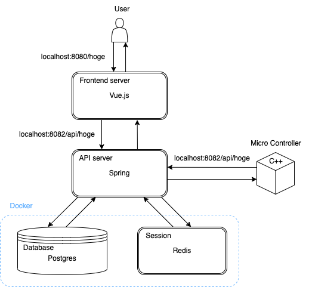

# stamp-iot

---

## システム構成

- 本システムのアクターは下記の通りである(権限は未定)
  - 管理者
  - ユーザー
- 本システムは下記に大別される
  - マイクロコントローラー(C++)
  - フロントエンド(Vue, TypeScript)
  - バックエンド(Spring)
  - セッション(Redis)
  - データベース(Postgres)
- システム構成図
  

## コンセプト(未達成も含む)

- マイクロコントローラーおよび各種センサを用いて大気・土壌(主に作土層)環境を可視化
  - マイクロコントローラーはコンセントのない野外でも動作可能なように省電力であること
- マイクロコントローラーを用いてセンサより測定した値はローカル(microSD カード)だけでなく，サーバー上に保存される
- マイクロコントローラーに紐づくユーザーは測定した値をブラウザ上で表示できる(グラフ化，変動予測等)

## 各種バージョン

- フロントエンド
  - vue v.3.2.13
  - vue-router v.4.0.3
  - vuetify v.3.0.3
  - pinia v.2.0.27
  - axios v.1.2.0
  - vue-material-design-icon v.5.1.2
  - core-js v.3.8.3
- バックエンド
  - Java 17
  - spring boot v.3.0.0
  - lombok v.1.18.24
  - spring boot 系 ([公式](https://spring.pleiades.io/spring-boot/docs/current/reference/html/using.html)が推奨しているためバージョンは指定しない方が良い?)
    - spring boot starter data jpa
    - spring boot starter web
    - spring boot starter validation
    - spring boot starter data redis
- Docker
  - postgres v.14
  - redis v.7
  - redisinsight v.1.12.0

## マイクロコントローラー, 基板概要

- 給電方法は下記の通りである
  - USB Type-C(5V)
  - 2 芯ケーブル(7V ~ 26V)
    - ソーラーパネルを使用する場合は，バッテリーの過放電・過充電を防止するため，チャージャーを介した給電を推奨する
- 対応しているセンサは下記の通りである

  - SDI-12(下記以外のセンサも測定は可能)

    - WD-5 WET([A・R・P](https://www.arp-id.co.jp/))
    - WD-5 WTA([A・R・P](https://www.arp-id.co.jp/))
    - WD-5 WT([A・R・P](https://www.arp-id.co.jp/))
    - Digital TDT Soil Moisture Sensor([Acclima](https://acclima.com/))
    - Digital True TDR-315H Sensor([Acclima](https://acclima.com/))
    - Digital True TDR-315L Sensor([Acclima](https://acclima.com/))
    - TEROS-21(旧 MPS-2, MPS-6)([METER Environment](https://www.metergroup.co.jp/))
    - TEROS-12([METER Environment](https://www.metergroup.co.jp/))
    - TEROS-11([METER Environment](https://www.metergroup.co.jp/))

  - I2C
    - ENV.Ⅱ([M5STACK](https://m5stack.com/))
    - ENV.Ⅲ([M5STACK](https://m5stack.com/))
    - SGP30([M5STACK](https://m5stack.com/))
    - BH1750FVI-TR([M5STACK](https://m5stack.com/))

- 基板概要図

---

## 動作確認済環境

### OS

- macOS Ventura v.13.0
- Windows10 64bit

### IDE

- VSCode
- IntelliJ IDEA CE
- Arduino IDE v.1.8.16

---

## 環境構築手順

### Docker

1. `stamp-iot/docker` へ移動
2. `docker-compose up -d` を実行
3. `docker ps -a` を実行し，起動済みであることを確認

### フロントエンド

1. `stamp-iot/frontend` へ移動
2. `npm install` を実行
3. `npm run serve` を実行
4. ブラウザで `localhost:8080` へアクセスする

### バックエンド

1. Java17 をインストール ([Oracle](https://www.oracle.com/jp/java/technologies/downloads/#java17), [Amazon Corretto](https://docs.aws.amazon.com/corretto/latest/corretto-17-ug/downloads-list.html))
2. `stamp-iot/backend` へ移動
3. InntelliJ で `BackendApplication` を実行

### データベース
1. 初期テーブルはjpaにより自動で生成されるため，作成する必要はなし